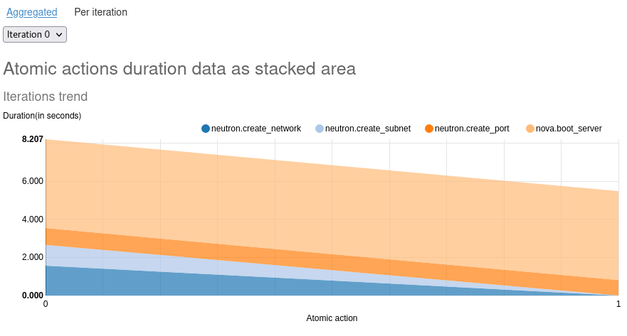
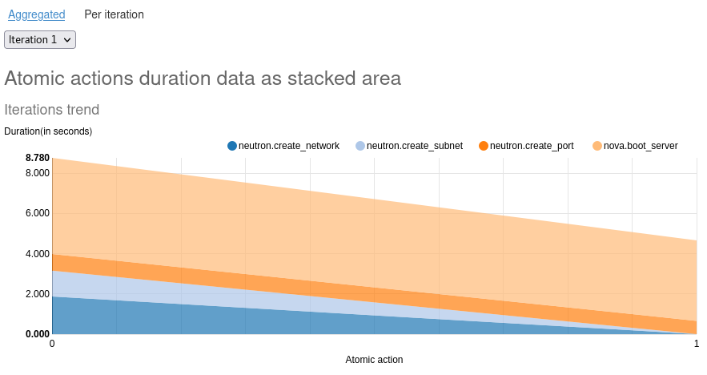
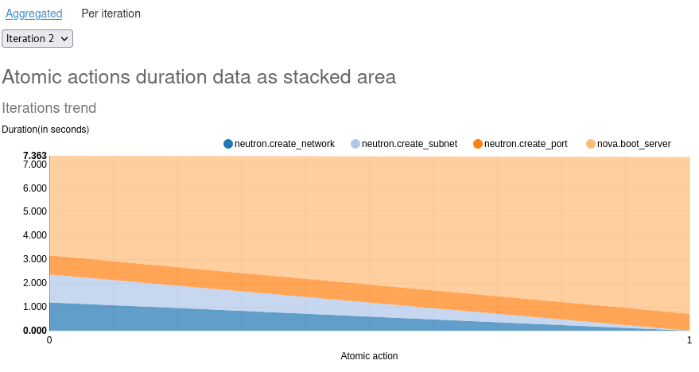
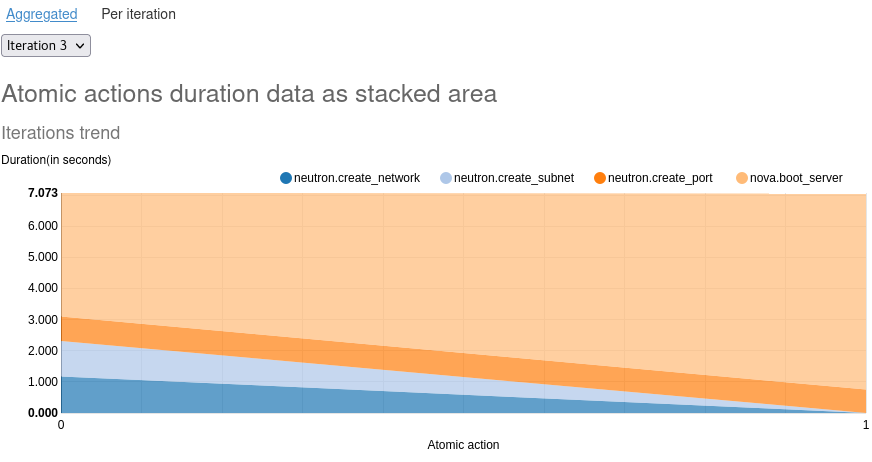
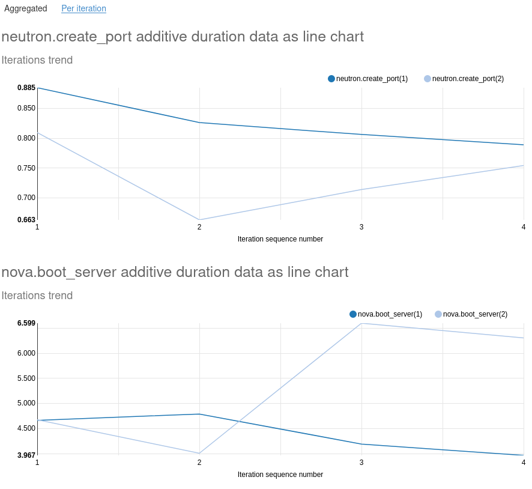
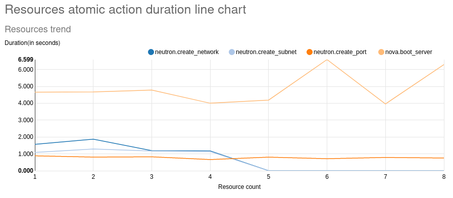

======
Charts
======

To include any of the custom charts from Browbeat in a scenario, the following lines will have to be included in the python file of the program.

.. code-block:: python

   import sys
   import os
   sys.path.append(os.path.abspath(os.path.join(os.path.dirname(__file__), '../reports')))
   from generate_scenario_duration_charts import ScenarioDurationChartsGenerator  # noqa: E402

The custom charts will appear in the "Scenario Data" section of the Rally HTML report.

Chart - add_per_iteration_complete_data
^^^^^^^^^^^^^^^^^^^^^^^^^^^^^^^^^^^^^^^

This plugin generates a stacked area graph for duration trend for each atomic action in an iteration.
To include this chart in any scenario, add the following lines at the end of the run() function of the scenario in the python file.

.. code-block:: python

   self.duration_charts_generator = ScenarioDurationChartsGenerator()
   self.duration_charts_generator.add_per_iteration_complete_data(self)

The graphs will appear under the "Per iteration" section of "Scenario Data" in the Rally HTML report.
The resulting graphs will look like the images below.

Chart - add_duplicate_atomic_actions_iteration_additive_data
^^^^^^^^^^^^^^^^^^^^^^^^^^^^^^^^^^^^^^^^^^^^^^^^^^^^^^^^^^^^

This plugin generates line graphs for atomic actions that have been executed more than once in the same iteration.
To include this chart in any scenario, add the following lines at the end of the run() function of the scenario in the python file.

.. code-block:: python

   self.duration_charts_generator = ScenarioDurationChartsGenerator()
   self.duration_charts_generator.add_duplicate_atomic_actions_iteration_additive_data(self)

The graphs will	appear under the "Aggregated" section of "Scenario Data" in the Rally HTML report.
The resulting graphs will look like the	images below.

Chart - add_all_resources_additive_data
^^^^^^^^^^^^^^^^^^^^^^^^^^^^^^^^^^^^^^^

This plugin generates a line graph for duration data from each resource created by Rally.
To include this chart in any scenario, add the following lines at the end of the run() function of the scenario in the python file.

.. code-block:: python

   self.duration_charts_generator = ScenarioDurationChartsGenerator()
   self.duration_charts_generator.add_all_resources_additive_data(self)

The graphs will appear under the "Aggregated" section of "Scenario Data" in the Rally HTML report.
The resulting graphs will look like the images below.

