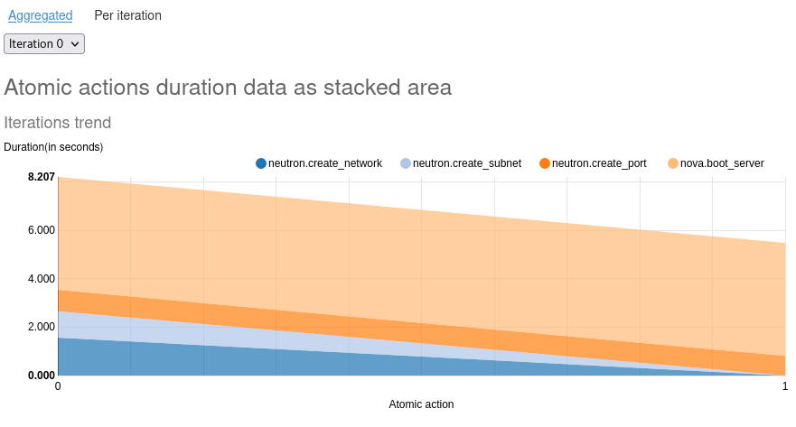
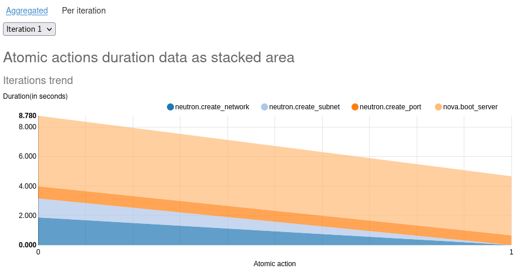
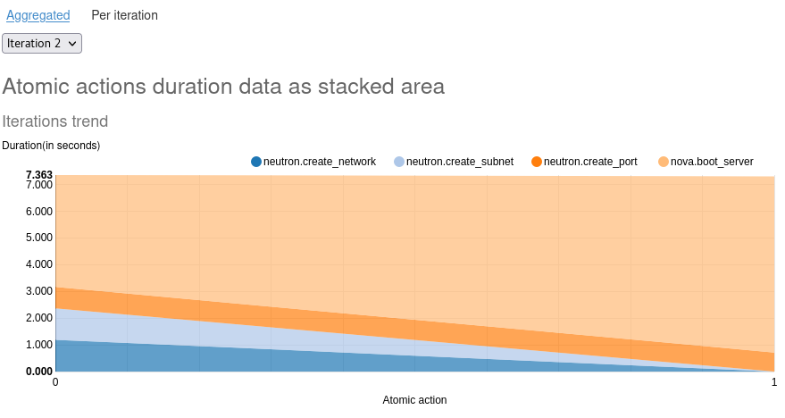
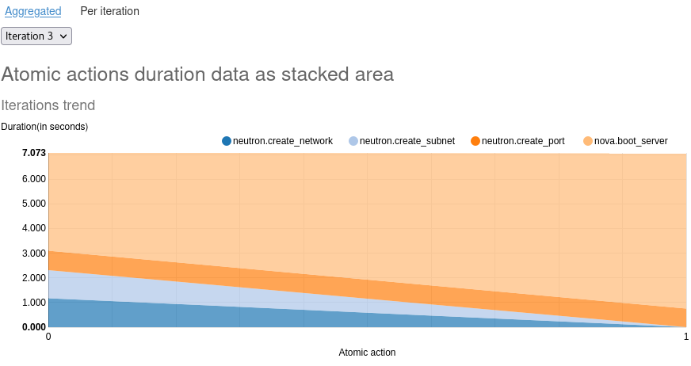
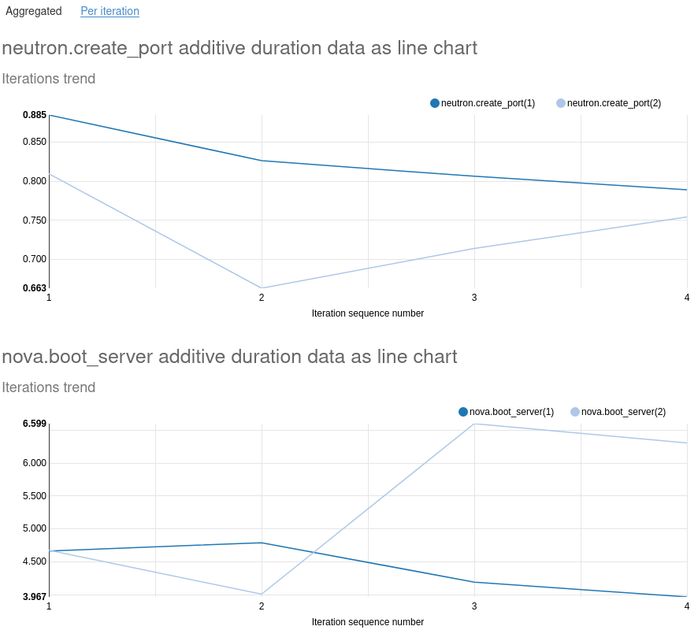
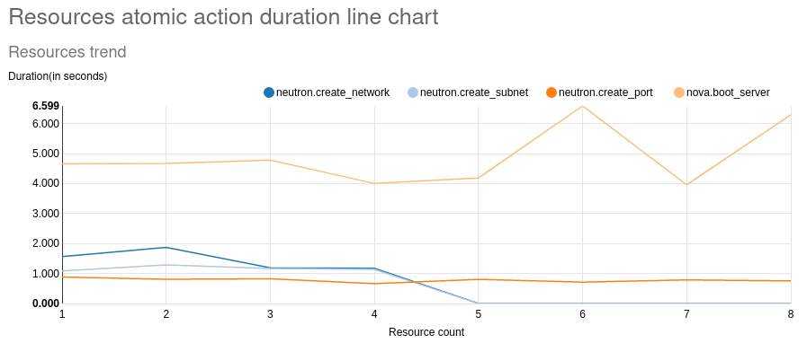

=============
Plugins
=============

Rally
~~~~~

Context - browbeat_delay
^^^^^^^^^^^^^^^^^^^^^^^^

This context allows a setup and cleanup delay to be introduced into a scenario.

Context - browbeat_persist_network
^^^^^^^^^^^^^^^^^^^^^^^^^^^^^^^^^^

This context creates network resources that persist upon completion of a rally run.  It is used in conjunction with the nova_boot_persist_with_network and  nova_boot_persist_with_network_volume plugin scenarios. You can also use `neutron purge` command to purge a project/tenant of neutron network resources.

Scenario - nova_boot_persist
^^^^^^^^^^^^^^^^^^^^^^^^^^^^

This scenario creates instances without a network that persist upon completion of a rally run.  This scenario is best used for excerising the Telemetry systems within an OpenStack Cloud.  Alternatively, it can be used to put idle instances on a cloud for other workloads to compete for resources.  The scenario is referenced in the Telemetry Browbeat configurations in order to build a "stepped" workload that can be used to analyze Telemetry performance and scalability.

Scenario - nova_boot_persist_with_volume
^^^^^^^^^^^^^^^^^^^^^^^^^^^^^^^^^^^^^^^^

This scenario creates instances that have an attached volume and persist upon completion of a rally run. This scenario is best used for excerising the Telemetry systems within an OpenStack Cloud.  It increases the Telemetry workload by creating more resources that the Telemetry services must collect and process metrics over.  Alternatively, it can be used to put idle instances on a cloud for other workloads to compete for resources.  The scenario is referenced in the Telemetry Browbeat configurations in order to build a "stepped" workload that can be used to analyze Telemetry scalability.

Scenario - nova_boot_persist_with_network
^^^^^^^^^^^^^^^^^^^^^^^^^^^^^^^^^^^^^^^^^

This scenario creates instances that are attached to a network and persist upon completion of a rally run. This scenario is best used for excerising the Telemetry systems within an OpenStack Cloud.  It increases the Telemetry workload by creating more resources that the Telemetry services must collect and process metrics over.  Alternatively, it can be used to put idle instances on a cloud for other workloads to compete for resources.  The scenario is referenced in the Telemetry Browbeat configurations in order to build a "stepped" workload that can be used to analyze Telemetry scalability.

Scenario - nova_boot_persist_with_network_fip
^^^^^^^^^^^^^^^^^^^^^^^^^^^^^^^^^^^^^^^^^^^^^

This scenario creates instances with a nic and associates a floating ip that persist upon completion of a rally run.  It is used as a workload with Telemetry by spawning many instances that have many metrics for the Telemetry subsystem to collect upon.

Scenario - nova_boot_persist_with_network_volume
^^^^^^^^^^^^^^^^^^^^^^^^^^^^^^^^^^^^^^^^^^^^^^^^

This scenario create instances with a nic and a volume that persist upon completion of a rally run.  It is used as a workload with Telemetry by spawning many instances that have many metrics for the Telemetry subsystem to collect upon.

Scenario - nova_boot_persist_with_network_volume_fip
^^^^^^^^^^^^^^^^^^^^^^^^^^^^^^^^^^^^^^^^^^^^^^^^^^^^

This scenario creates instances with a nic, a volume and associates a floating ip that persist upon completion of a rally run.  It is used as a workload with Telemetry by spawning many instances that have many metrics for the Telemetry subsystem to collect upon.

Charts
^^^^^^

To include any of the custom charts from Browbeat in a scenario, the following lines will have to be included in the python file of the program.
.. code-block:: python

   import sys
   import os

   sys.path.append(os.path.abspath(os.path.join(os.path.dirname(__file__), '../reports')))
   from generate_scenario_duration_charts import ScenarioDurationChartsGenerator  # noqa: E402

The customc charts will appear in the "Scenario Data" section of the Rally HTML report.

Chart - add_per_iteration_complete_data
^^^^^^^^^^^^^^^^^^^^^^^^^^^^^^^^^^^^^^^

This plugin generates a stacked area graph for duration trend for each atomic action in an iteration.
To include this chart in any scenario, add the following lines at the end of the run() function of the scenario in the python file.

.. code-block:: python

   self.duration_charts_generator = ScenarioDurationChartsGenerator()
   self.duration_charts_generator.add_per_iteration_complete_data(self)

The graphs will appear under the "Per iteration" section of "Scenario Data" in the Rally HTML report.
The resulting graphs will look like the images below.

Chart - add_duplicate_atomic_actions_iteration_additive_data
^^^^^^^^^^^^^^^^^^^^^^^^^^^^^^^^^^^^^^^^^^^^^^^^^^^^^^^^^^^^

This plugin generates line graphs for atomic actions that have been executed more than once in the same iteration.
To include this chart in any scenario, add the following lines at the end of the run() function of the scenario in the python file.

.. code-block:: python

   self.duration_charts_generator = ScenarioDurationChartsGenerator()
   self.duration_charts_generator.add_duplicate_atomic_actions_iteration_additive_data(self)

The graphs will	appear under the "Aggregated" section of "Scenario Data" in the Rally HTML report.
The resulting graphs will look like the	images below.

Chart - add_all_resources_additive_data
^^^^^^^^^^^^^^^^^^^^^^^^^^^^^^^^^^^^^^^

This plugin generates a line graph for duration data from each resource created by Rally.
To include this chart in any scenario, add the following lines at the end of the run() function of the scenario in the python file.

.. code-block:: python

   self.duration_charts_generator = ScenarioDurationChartsGenerator()
   self.duration_charts_generator.add_all_resources_additive_data(self)

The graphs will appear under the "Aggregated" section of "Scenario Data" in the Rally HTML report.
The resulting graphs will look like the images below.

